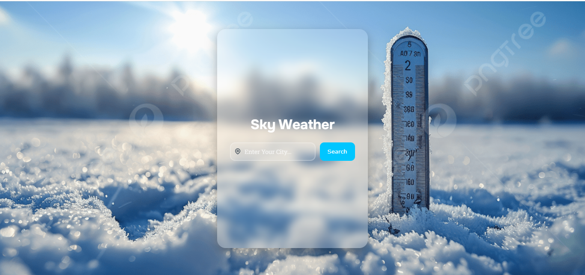

# 🌤️ Sky Weather — Modern Weather Dashboard

A sleek and responsive weather dashboard built using **HTML, CSS, and Vanilla JavaScript** that provides real-time weather information and a 4-day forecast using the **WeatherAPI** service.

Designed with a modern **glassmorphism UI**, animated transitions, dynamic temperature visualization, and responsive layout support.

---

## 📸 Preview



---

## ✨ Features

* 🔍 Search weather by city name
* 🌡️ Real-time temperature display
* 📅 4-day weather forecast
* 💧 Humidity information
* 💨 Wind speed tracking
* 🌡️ “Feels Like” temperature
* 📊 Animated temperature progress bar
* 🪟 Modern glassmorphism interface
* 🎞️ Smooth card reveal animation
* 📱 Responsive design for smaller screens
* 🌍 Country abbreviation support
* ⚠️ Beautiful alerts using SweetAlert2
* 🖼️ Dynamic weather icons from API

---

## 🛠️ Tech Stack

| Technology        | Purpose                              |
| ----------------- | ------------------------------------ |
| HTML5             | Structure & layout                   |
| CSS3              | Styling, animations & responsiveness |
| JavaScript (ES6+) | API calls & DOM manipulation         |
| WeatherAPI        | Live weather & forecast data         |
| SweetAlert2       | Stylish popup alerts                 |
| Tabler Icons      | UI icons                             |

---

# 📁 Project Structure

```bash
SkyWeather/
│
├── index.html          # Main HTML structure
├── style.css           # Main styling file
├── responsive.css      # Responsive media queries
├── core.js             # Main JavaScript logic
├── countrycode.js      # Country abbreviation mapping
│
├── assets/
│   ├── snow.png
│   └── image.png
│
└── README.md
```

---

# ⚙️ Installation & Setup

## 1️⃣ Clone the Repository

```bash
git clone https://github.com/HafizEngineerMuhammadAbdullah/MyWeatherApp.git
```

Move into the project folder:

```bash
cd MyWeatherApp
```

---

## 2️⃣ Get Your Free API Key

Visit:

[WeatherAPI](https://www.weatherapi.com?utm_source=chatgpt.com)

* Create a free account
* Generate your API key
* Copy the key

---

## 3️⃣ Add Your API Key

Open `core.js`

Replace:

```js
const apiKey = "your_api_key_here";
```

with your real API key.

---

## 4️⃣ Run the Project

Simply open:

```bash
index.html
```

in your browser.

No frameworks, build tools, or server setup required.

---

# 🌐 API Endpoint Used

```bash
GET https://api.weatherapi.com/v1/forecast.json
```

### Query Parameters

| Parameter | Description             |
| --------- | ----------------------- |
| key       | Your WeatherAPI key     |
| q         | City name               |
| days      | Number of forecast days |

---

# 📦 Weather Data Used

| Field                  | Description            |
| ---------------------- | ---------------------- |
| current.temp_c         | Current temperature    |
| current.humidity       | Humidity percentage    |
| current.wind_kph       | Wind speed             |
| current.feelslike_c    | Feels-like temperature |
| current.condition.text | Weather condition      |
| current.condition.icon | Weather icon           |
| forecast.forecastday   | Multi-day forecast     |

---

# 🎨 UI & CSS Highlights

## ✨ Glassmorphism Design

```css
background: rgba(255,255,255,0.12);
backdrop-filter: blur(10px);
```

Creates the frosted-glass modern dashboard effect.

---

## 📊 Dynamic Temperature Bar

Temperature values are converted into percentages and animated smoothly.

```js
const percent = ((temp - min) / (max - min)) * 100;
```

---

## 🎞️ Slide-In Animation

```css
@keyframes slide-in
```

Used to smoothly reveal the weather dashboard after successful API fetch.

---

## 🔥 Interactive Hover Effects

Weather cards slightly lift upward on hover for a modern UI feel.

```css
transform: translateY(-3px);
```

---

# 🧠 JavaScript Concepts Used

This project demonstrates practical usage of:

* Async/Await
* Fetch API
* DOM Manipulation
* Event Handling
* Array Iteration (`forEach`)
* Template Literals
* Functions
* Object Access
* Conditional Logic
* Dynamic Styling
* Error Handling with `try...catch`

---

# 📱 Responsive Design

The project includes a separate `responsive.css` file for handling smaller screen sizes and improving mobile usability.

---

# 🐛 Future Improvements

* [ ] Add dark/light mode toggle
* [ ] Add Celsius ↔ Fahrenheit switch
* [ ] Add weather search history
* [ ] Add sunrise & sunset timing
* [ ] Add geolocation support
* [ ] Add loading spinner
* [ ] Add hourly forecast
* [ ] Add weather background auto-change

---

# 📄 License

This project is licensed under the MIT License.

---

# 🙌 Credits

* Weather Data by [WeatherAPI](https://www.weatherapi.com?utm_source=chatgpt.com)
* Icons by [Tabler Icons](https://tabler-icons.io?utm_source=chatgpt.com)
* Alerts by [SweetAlert2](https://sweetalert2.github.io?utm_source=chatgpt.com)
* Fonts by [Google Fonts](https://fonts.google.com?utm_source=chatgpt.com)

---

# 👨‍💻 Author

Created by [Muhammad Abdullah GitHub](https://github.com/HafizEngineerMuhammadAbdullah?utm_source=chatgpt.com)

---

# ⭐ Support

If you like this project:

* ⭐ Star the repository
* 🍴 Fork it
* 🛠️ Improve it
* 🚀 Share it with others
