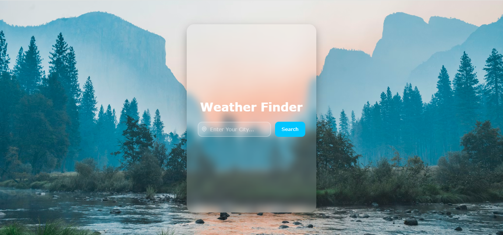

# 🌤️ Weather Finder

A clean, glassmorphism-styled weather app that lets users search for real-time weather data by city name. Built with vanilla HTML, CSS, and JavaScript.

---

## 📸 Preview

> A frosted-glass card sits centered on a scenic nature background. Users type a city name, hit Search, and the card flips to reveal live weather data.

## 

## 🚀 Features

- 🔍 Search weather by city name
- 🌡️ Displays temperature, humidity, wind speed & weather condition
- 💎 Glassmorphism UI with smooth animations
- 📱 Responsive design
- ✨ Glowing focus effects on input
- 🔄 Flip card transition between search and results

---

## 🛠️ Tech Stack

| Technology        | Usage                                          |
| ----------------- | ---------------------------------------------- |
| HTML5             | Structure & markup                             |
| CSS3              | Glassmorphism styling, animations, transitions |
| JavaScript (ES6+) | API calls, DOM manipulation                    |
| WeatherAPI        | Live weather data                              |

---

## 📁 Project Structure

```
weather-finder/
│
├── index.html       # Main HTML file
├── style.css        # All styling (glassmorphism, animations)
├── core.js          # JavaScript logic & API calls
└── README.md        # Project documentation
```

---

## ⚙️ Setup & Usage

### 1. Clone the repository

```bash
git clone https://github.com/HafizEngineerMuhammadAbdullah/MyWeatherApp.git
cd weather-finder
```

### 2. Get a free API key

1. Go to [https://www.weatherapi.com](https://www.weatherapi.com)
2. Sign up for a free account
3. Copy your API key from the dashboard

### 3. Add your API key

Open `core.js` and replace the placeholder:

```js
const API_KEY = "your_api_key_here";
```

### 4. Run the project

Just open `index.html` in your browser — no build tools or server needed!

```bash
open index.html
# or simply double-click the file
```

---

## 🌐 API Reference

This project uses the **OpenWeatherMap Current Weather API**:

```
GET https://api.weatherapi.com/v1/current.json?key={API_KEY}&q={city}
```

**Key response fields used:**

| Field                    | Description            |
| ------------------------ | ---------------------- |
| `current.temp_c`         | Temperature in °C      |
| `current.humidity`       | Humidity percentage    |
| `current.condition.text` | Weather condition text |
| `current.wind_kph`       | Wind speed in km/h     |
| `current.condition.icon` | Weather icon URL       |

---

## 🎨 CSS Highlights

- **Glassmorphism card** — `backdrop-filter: blur(10px)` with semi-transparent background
- **Glowing input focus** — `box-shadow: 0 0 0 3px rgba(0, 198, 255, 0.25)`
- **Flip card effect** — CSS `transform-style: preserve-3d` + `rotateY(180deg)`
- **Background** — Full-viewport nature image from Unsplash

---

## 🐛 Known Issues / Improvements

- [ ] Add loading spinner during API fetch
- [ ] Show error message for invalid city names
- [ ] Add °C / °F toggle
- [ ] Add 5-day forecast view

---

## 📄 License

This project is open source and available under the [MIT License](LICENSE).

---

## 🙌 Acknowledgements

- Background photo by [Luca Bravo](https://unsplash.com/@lucabravo) on [Unsplash](https://unsplash.com)
- Weather data by [WeatherAPI](https://www.weatherapi.com)
- Icons by [Tabler Icons](https://tabler-icons.io)
